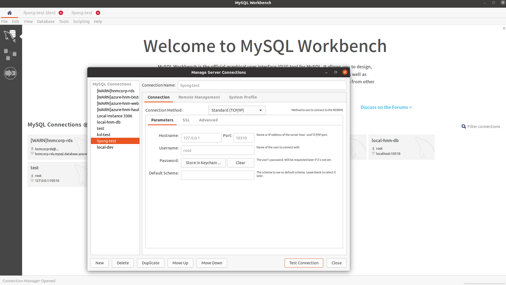
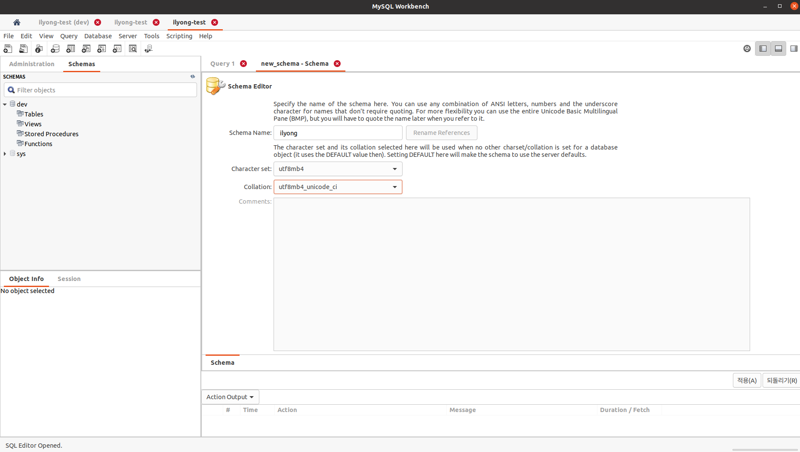
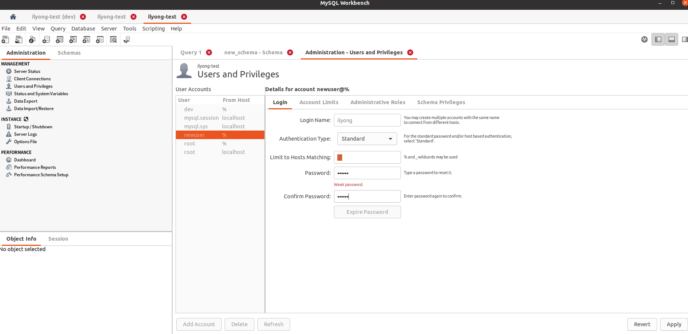
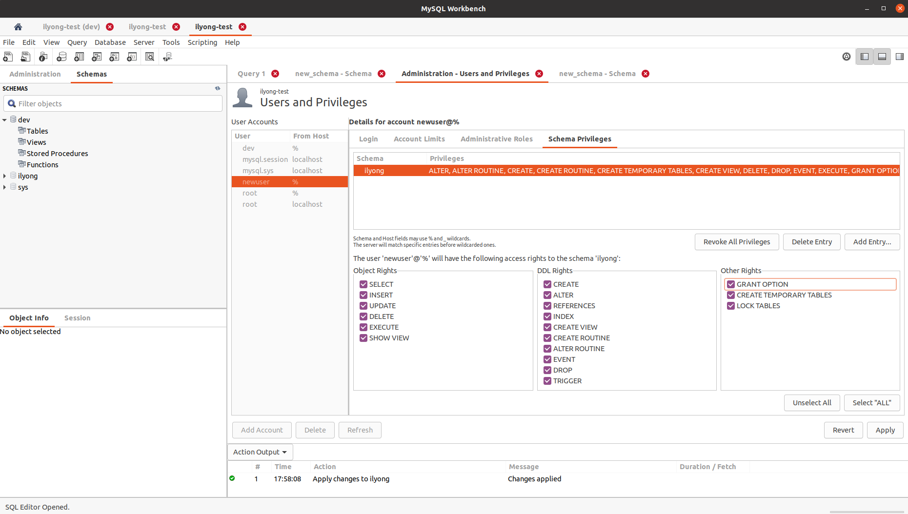

# NestJS Auth

## TODO List

- Prologue
  - [ ] Authentication
  - [ ] Authorization
  - [ ] 추가(TypeORM, Swagger)
- Setup
  - [ ] MySQL docker-compose
  - [ ] TypeORM Setup
  - [ ] User Entity Model
  - [ ] TypeORM Migration
- NestJS
  - [ ] NestJS Auth
  - [ ] Role-based Authorization
- 추가
  - [ ] Custom Decorator
  - [ ] Swagger

## 1. Prologue

### Authentication

### Authorization

### 추가(TypeORM, Swagger)

## 2. Setup

### MySQL docker-compose

1. `docker-compose.yml`로 mysql container환경을 구성합니다.

```yml
services:
  mysql:
    image: mysql:5.7
    container_name: dev-mysql
    restart: always
    ports:
      - 10310:3306
    environment:
      TZ: Asia/Seoul
      MYSQL_ROOT_PASSWORD: root
      MYSQL_DATABASE: dev
      MYSQL_USER: dev
      MYSQL_PASSWORD: dev
    command:
      - --character-set-server=utf8mb4
      - --collation-server=utf8mb4_unicode_ci
      - --skip-character-set-client-handshake
    volumes:
      - dev-mysql:/var/lib/mysql

volumes:
  dev-mysql:
```

2. `docker-compose up -d` 명령어를 사용하여 MySQL Docker Container를 생성해줍니다.

3. MySQL WorkBench에서 Container가 생성되었는지 확인하고,

   ```
   id: root
   pw: root
   ```

   로 Connect 합니다.
   

4. Schema(Database)를 만들어주고,
   

5. 왼쪽 위 `Administration` 탭의 `Users and Privileges`에서 새로운 account를 등록해줍니다.
   ```
   id: ilyong # 사용자 마음대루
   pw: ilyong # 사용자 마음대루
   ```
   
   
   차례대로 입력후 오른쪽 밑 `Apply`

### TypeORM Setup

1. Install package

```sh
$ npm i joi @nestjs/config
$ npm i @nestjs/typeorm typeorm mysql2
```

2. Database Connection

- 환경변수

```env
NODE_PORT=3000

MYSQL_HOST=127.0.0.1
MYSQL_PORT=10310
MYSQL_USERNAME=ilyong
MYSQL_PASSWORD=ilyong
MYSQL_DATABASE=ilyong
```

### User Entity Model

1. Create User Module, Service

```sh
$ nest generate module user
$ nest generate service user
$ nest generate controller user
```

2. Create User Entity

- User Entity 를 정의해줍니다.

```ts
// src/user/entity/user.entity.ts
import {
  Column,
  CreateDateColumn,
  DeleteDateColumn,
  Entity,
  PrimaryGeneratedColumn,
  UpdateDateColumn,
} from 'typeorm';

@Entity({ name: 'users' })
export class User {
  @PrimaryGeneratedColumn('uuid')
  id: string;

  @Column()
  username: string;

  @Column()
  password: string;

  @Column()
  avatar: string;

  @CreateDateColumn()
  createdAt: Date;

  @UpdateDateColumn()
  updatedAt: Date;

  @DeleteDateColumn()
  deletedAt: Date;

  @Column()
  version: string;
}
```

3. `AppModule`의 `TypeOrmModule.forRoot()` method는 TypeORM Package에서 나온 `createConnection()` 함수에 의해 노출된 모든 설정 속성들을 지원합니다.

```ts
// src/app.module.ts

@Module({
  imports: [
    ConfigModule.forRoot({
      envFilePath: '.env',
      isGlobal: true,
      validationSchema: Joi.object({
        NODE_PORT: Joi.string().required(),
        MYSQL_HOST: Joi.string().required(),
        MYSQL_PORT: Joi.string().required(),
        MYSQL_USERNAME: Joi.string().required(),
        MYSQL_PASSWORD: Joi.string().required(),
        MYSQL_DATABASE: Joi.string().required(),
      }),
    }),
    TypeOrmModule.forRoot({
      type: 'mysql',
      host: process.env.MYSQL_HOST,
      port: +process.env.MYSQL_PORT,
      username: process.env.MYSQL_USERNAME,
      password: process.env.MYSQL_PASSWORD,
      database: process.env.MYSQL_DATABASE,
      synchronize: true,
      logging: true,
      entities: [],
      charset: 'utf8mb4_unicode_ci',
      timezone: '+09:00',
    }),
  ],
  controllers: [AppController],
  providers: [AppService],
})
export class AppModule {}
```

3. `UserModule`에서 `forFeature()` method를 사용함으로써 현재(User) 스코프에 Repository를 등록을 정의합니다. 그러면, 현재 스코프(UserModule~)에서 `@InjectRepository()` 데코레이터를 사용함으로써, `UserModule`내의 Provider에서 `UsersRepository`를 inject 할 수 있습니다!

```ts
// src/user/user.module.ts
@Module({
  imports: [TypeOrmModule.forFeature([User])],
  providers: [UserService],
  controllers: [UserController],
})
export class UserModule {}
```

> **Alternatively ♻**
>
> `ormconfig.json`을 project root directory에 생성하여 Configuration 객체를 forRoot()로 통과시킬 수 도 있습니다.

4. `npm run build` -> `npm run start` 또는 `npm run start:dev` script를 실행하면 database에 `users` Table이 생성된 것 을 확인할 수 있습니다.

### +) TypeORM Migration

- `forRoot()`의 `synchronize: true`는 개발환경에서만 사용해야합니다.

  왜냐하면 `*.entity.ts`를 변경할때마다 변경사항들을 해당하는 Database Table에 바로 반영하기 때문에, 자칫하면 data를 잃어버릴 수도 있습니다.

(TODO: Migration 방법)

## 3. NestJS

JWT Role-based access control 을 만들어 봅시다. 그전에 user 를 만들기 전에, 비밀번호를 hashing 해줍시다.

### Hashing Password Before User Insert

1. Install Package

```sh
$ npm i bcrypt
$ npm i --save-dev @types/bcrypt
```

2. User Entity

   [TypeORM - Listeners and Subscribers](https://typeorm.io/#/listeners-and-subscribers/beforeinsert) 를 참고하시면 TypeORM에 특별한 기능이 있습니다.

   > Any of your entities can have methods with custom logic that listen to specific entity events. You must mark those methods with special decorators depending on what event you want to listen to.

   모든 Entity들은 특정 entity event를 기다리고 있는 사용자 정의 로직 메서드를 가질 수 있습니다.

   저는 `@BeforeInsert()` 라는 데코레이터를 사용하여, 사용자를 등록하여 DB에 Insert 되기 전, 비밀번호를 hashing 하는 작업을 해보도록 하겠습니다.

```ts
// ...
export class User {
  // ...
  @BeforeInsert()
  async hashPassword(): Promise<void> {
    if (this.password)
      // 사용자 정보를 update하는 것도 insert가 발동되기 때문.
      try {
        this.password = await bcrypt.hash(this.password, 10);
      } catch (e) {
        console.log(e);
        throw new InternalServerErrorException();
      }
  }
}
```

3. UserController - Sign up (회원가입)
회원가입을 위한 작업을 해봅시다.
- 먼저 DTO를 만들어 봅시다.
```ts
// src/common/common.dto.ts

export class CommonResponseDto {
  status: number;
  error?: string;
}


// src/user/dtos/create-user.dto.ts

import { IsEmail, IsOptional, IsString } from 'class-validator';
import { CommonResponseDto } from 'src/common/common.dto';

export class CreateUserRequestDto {
  @IsEmail()
  username: string;

  @IsString()
  password: string;

  @IsOptional()
  @IsString()
  avatar = '';
}

export class CreateUserResponseDto extends CommonResponseDto {}
```
- 다음으로 `UserService`를 만들어 봅시다.
```ts

@Injectable()
export class UserService {
  constructor(
    @InjectRepository(User)
    private readonly userRepository: Repository<User>,
  ) {}

  async signInUser(data: CreateUserRequestDto) {
    try {
      const exist = await this.userRepository.findOne({
        username: data.username,
      });
      if (exist)
        throw new BadRequestException({
          message: `이미 존재하는 사용자입니다.`,
        });

      const user = await this.userRepository.create(data);
      await this.userRepository.save(user);
      return {
        status: 201,
      };
    } catch (error) {
      console.log(error);
      return {
        status: error.status,
        error: error.message,
      };
    }
  }
}
```

- 다음으로 `UserController`를 만들어 봅시다.
```ts
import { Body, Controller, Post } from '@nestjs/common';
import {
  CreateUserRequestDto,
  CreateUserResponseDto,
} from './dtos/create-user.dto';
import { UserService } from './user.service';

@Controller('users')
export class UserController {
  constructor(private readonly userService: UserService) {}
  @Post()
  signIn(@Body() data: CreateUserRequestDto): Promise<CreateUserResponseDto> {
    return this.userService.signInUser(data);
  }
}
```

4. Test
```json
// [POST] localhost:3000/users
// Request Body
{
  "username": "1yongs3_@naver.com",
  "password": "test",
  "avatar":"testavatar"
}

// response
// success
{
  "status": 201
}
// error
{
 "statusCode": 40x,
 "message": ["이미 존재하는 사용자입니다."],
 "error": "Bad Request"
}
```

### NestJS Auth

1. install Package
  ```sh
  $ npm install --save jsonwebtoken
  $ npm i --save-dev @types/jsonwebtoken
  ```

2. Login 시 Token 발행 로직
- JWT Module
```ts
// src/jwt/jwt.module.ts

@Module({})
@Global()
export class JwtModule {
  static forRoot(options: JwtModuleOptions): DynamicModule {
    return {
      module: JwtModule,
      exports: [JwtService],
      providers: [
        {
          provide: CONFIG_OPTIONS,
          useValue: options,
        },
        JwtService,
      ],
    };
  }
}
```

- JWT Module Options **Depedency Injection**
```ts
// src/jwt/jwt.constant.ts
export const CONFIG_OPTIONS = 'CONFIG_OPTIONS';


// src/jwt/jwt.interface.ts
export interface JwtModuleOptions {
  privateKey: string;
}
```

- JWT Service
```ts
// src/jwt/jwt.service.ts

@Injectable()
export class JwtService {
  constructor(
    @Inject(CONFIG_OPTIONS) private readonly options: JwtModuleOptions,
  ) {}

  // 로그인 성공하면 token을 만들어 보냄
  sign(userId: string): string {
    return jwt.sign({ id: userId }, this.options.privateKey);
  }
}
```

- User Service
```ts
// src/user/user.service.ts

 async signIn({
    username,
    password,
  }: SignInRequestDto): Promise<SignInResponseDto> {
    try {
      const user = await this.userRepository.findOne({ username });
      if (!user) {
        throw new NotFoundException({
          error: 'Not Found',
          message: ['사용자를 찾지 못했습니다.'],
        });
      }
      const passwordCorrect = await user.checkPassword(password);
      if (!passwordCorrect) {
        throw new BadRequestException({
          error: 'Bad Request',
          message: ['비밀번호가 틀렸습니다.'],
        });
      }

      const token = this.jwtService.sign(user.id);
      return {
        statusCode: 201,
        token,
      };
    } catch (error) {
      return {
        statusCode: error.status,
        ...error.response,
      };
    }
  }
```

3. Auth Module
   TODO:

4. Auth Guard
   TODO:

5. UserController - Sign in (로그인))
   TODO:

### Role-based Authorization

## 4. 추가

### Custom Decorator

### Swagger
