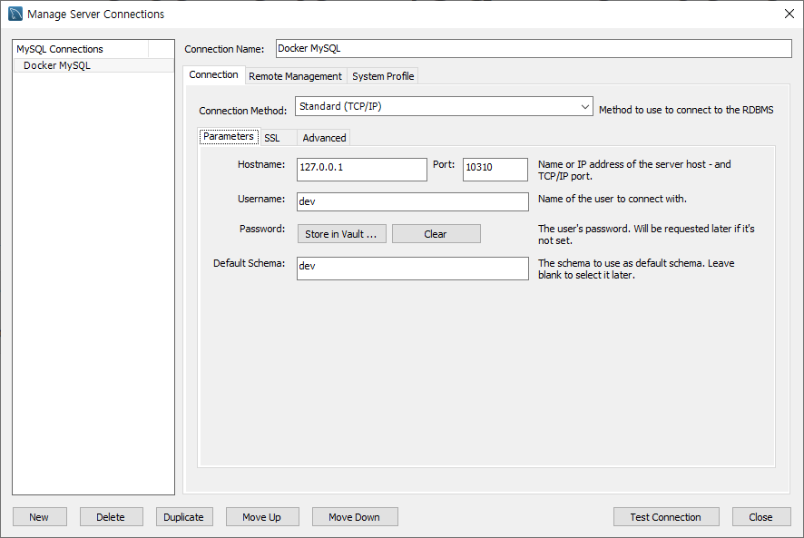

# NestJS Auth

## TODO List
- Prologue
  - [ ] Authentication
  - [ ] Authorization
  - [ ] 추가(TypeORM, Swagger)
- Setup
  - [ ] MySQL docker-compose
  - [ ] TypeORM Setup
  - [ ] User Entity Model
  - [ ] TypeORM Migration
- NestJS
  - [ ] NestJS Auth
  - [ ] Role-based Authorization
- 추가
  - [ ] Custom Decorator
  - [ ] Swagger

## 1. Prologue
### Authentication
### Authorization
### 추가(TypeORM, Swagger)

## 2. Setup
### MySQL docker-compose
1. `docker-compose.yml`로 mysql container환경을 구성합니다.
  ```yml
  services:
    mysql:
      image: mysql:5.7
      container_name: dev-mysql
      restart: always
      ports:
        - 10310:3306
      environment:
        TZ: Asia/Seoul
        MYSQL_ROOT_PASSWORD: root
        MYSQL_DATABASE: dev
        MYSQL_USER: dev
        MYSQL_PASSWORD: dev
      command:
        - --character-set-server=utf8mb4
        - --collation-server=utf8mb4_unicode_ci
        - --skip-character-set-client-handshake
      volumes:
        - dev-mysql:/var/lib/mysql

  volumes:
    dev-mysql:  
  ```
2. `docker-compose up -d` 명령어를 사용하여 MySQL Docker Container를 생성해줍니다.
3. MySQL WorkBench에서 연결을 확인해줍니다. (optional)


### TypeORM Setup
### User Entity Model
### TypeORM Migration

## 3. NestJS
### NestJS Auth
### Role-based Authorization

## 4. 추가
### Custom Decorator
### Swagger

